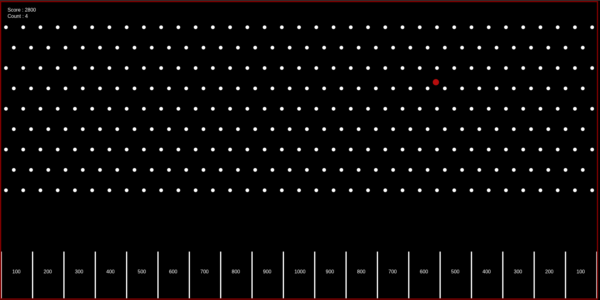
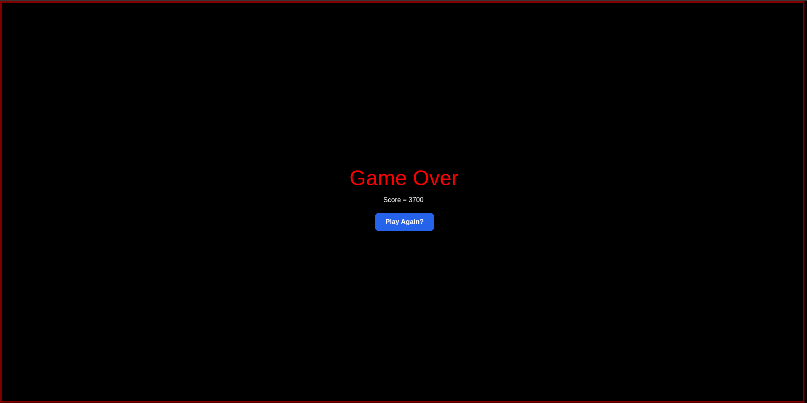

# Plinko Arcade

Plinko Arcade is a simple physics-based browser game built using **JavaScript**, **p5.js**, and **Matter.js**. The objective is straightforward: drop balls onto the board, let physics take over, and try to land them in the highest-scoring slots. While the rules are easy to understand, every drop is unpredictable, making each game feel different from the last.

This project was developed to explore game development concepts such as physics simulation, collision detection, score management, and interactive user interfaces while recreating the satisfying gameplay of the classic Plinko board.

---

## Preview

### Gameplay



### Game Over Screen



---

## Features

* Physics simulation powered by Matter.js
* Interactive peg collision system
* Real-time score tracking
* Multiple scoring zones with varying point values
* Limited ball count for strategic gameplay
* Game over screen with restart functionality
* Clean and responsive user interface

---

## Technologies Used

* JavaScript
* p5.js
* Matter.js
* HTML5
* CSS3

---

## Getting Started

### Clone the Repository

```bash
git clone https://github.com/dslord/Plinko-Arcade.git
cd Plinko-Arcade
```

### Run the Project

Open `index.html` in your preferred web browser.

---

## Gameplay

1. Launch the game.
2. Click to drop a ball into the board.
3. Watch the ball interact with pegs and obstacles.
4. Earn points based on the slot where the ball lands.
5. Use all available balls to achieve the highest score possible.

---

## Project Structure

```text
├── Game/
│   ├── Divisions.js
│   ├── Ground.js
│   ├── Particle.js
│   ├── Plinko.js
│   └── sketch.js
│
├── src/
│   ├── matter.js
│   ├── p5.js
│   ├── p5.dom.min.js
│   ├── p5.play.js
│   └── p5.sound.min.js
│
├── assets/
│   ├── preview-1.png
│   └── preview-2.png
│
├── LICENSE
├── index.html
├── style.css
└── README.md
```

---

## Scoring System

| Slot Position | Points   |
| ------------- | -------- |
| Outer Slots   | 100      |
| Middle Slots  | 200–700  |
| Center Slots  | 800–1000 |

Higher-value slots are located closer to the center of the board, making them more difficult to reach consistently.

---

## Contributing

Contributions are welcome. Feel free to fork the repository, create a feature branch, and submit a pull request.

---

## License

This project is licensed under the MIT License. See the LICENSE file for details.

---

Developed by **dslord**.
